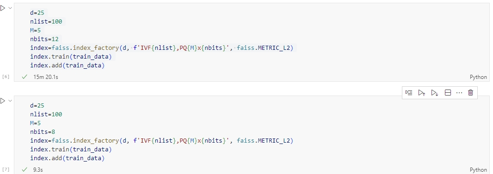

# 任务目标

## 初步学习

- faiss向量数据库的学习和使用
- Ann-Benchmark的学习和使用

## 中期学习

设计一个合适的benchmark：包括数据/向量的分片以及合并，最后到topk的测试（k要大）

# 初步学习

## faiss（Facebook AI Similarity Search）学习和使用

The Hierarchical Navigable Small World indexing method is based on a graph built on the indexed vectors. At search time, the graph is explored in a way that converges to the nearest neighbors as quickly as possible. The `IndexHNSW` uses a flat index as underlying storage to quickly access the database vectors and abstract the compression / decompression of vectors. HNSW depends on a few important parameters:

- `M` is the number of neighbors used in the graph. A larger M is more accurate but uses more memory
- `efConstruction` is the depth of exploration at add time
- `efSearch` is the depth of exploration of the search

[Faiss indexes · facebookresearch/faiss Wiki (github.com)](https://github.com/facebookresearch/faiss/wiki/Faiss-indexes)

关于如何选择index：[Guidelines to choose an index · facebookresearch/faiss Wiki (github.com)](https://github.com/facebookresearch/faiss/wiki/Guidelines-to-choose-an-index)

[FAISS 的索引选择 - 知乎 (zhihu.com)](https://zhuanlan.zhihu.com/p/102829576#:~:text=使用,"Flat" 并且Flat是占用内存最小的一种方案，其他任何添加索引的方案只会占用更多内存，因为索引本身也有大小。)

-----

**使用faiss的基本步骤**

1、数据转换：把原始数据转换为"float32"数据类型的向量。

- 其实这个里面也涉及到一步——embedding选择然后进行embedding

2、index构建：用 faiss 构建index

3、数据添加：将向量add到创建的index中

4、通过创建的index进行检索

索引的构建又分为全量构建索引和增量构建索引

```python
import faiss
import numpy as np 

# 〇，基本参数设置
d = 64                                           # 向量维度
nb = 100000                                      # index向量库的数据量
nq = 1000                                        # 待检索query的数目
index_type = 'Flat'                              # index 类型
metric_type = faiss.METRIC_INNER_PRODUCT         # 度量(相似度/距离)类型


# 一，准备向量库向量
print('============================== 1,base vector ==============================')
np.random.seed(1234)             
xb = np.random.random((nb, d)).astype('float32')# faiss需要先将数据转换成float32
xb[:, 0] += np.arange(nb) / 1000.                # index向量库的向量,用到了广播特性来进行矩阵的相加，然后这里是只改变了矩阵的第一列
faiss.normalize_L2(xb)# 正则化
print('xb.shape = ',xb.shape,'\n')


# 二，准备查询向量
print('============================== 2,query vector ==============================')
xq = np.random.random((nq, d)).astype('float32')
xq[:, 0] += np.arange(nq) / 1000.                # 待检索的query向量
faiss.normalize_L2(xq)
print('xq.shape = ',xq.shape,'\n')

# 三，构建向量库索引
print('============================== 3,create&train ==============================')
index = faiss.index_factory(d,index_type,metric_type)    #等价于 faiss.IndexFlatIP(d),但是index_factory可以形成更加复杂的组合     
print('index.is_trained=',index.is_trained)    # 输出为True，代表该类index不需要训练，只需要add向量进去即可
index.train(xb)
index.add(xb)                                      # 将向量库中的向量加入到index中
print('index.ntotal=',index.ntotal,'\n')           # 输出index中包含的向量总数，为100000 


# 四，相似向量查询
print('============================== 4, search ==============================')
k = 4                       # topK的K值
D, I = index.search(xq, k)  # xq为待检索向量，返回的I为每个待检索query最相似TopK的索引list，D为其对应的距离

print('nearest vector ids:\n',I[:5],'\n')
print('metric(distances/scores) to query:\n',D[-5:],'\n')

# 五，增删索引向量
print('============================== 5, add&remove ==============================')
xa = np.random.random((10000, d)).astype('float32')
xa[:, 0] += np.arange(len(xa)) / 1000.                
faiss.normalize_L2(xa)
index.add(xa)
print('after add, index.ntotal=',index.ntotal) 
index.remove_ids(np.arange(1000,1111))
print('after remove, index.ntotal=',index.ntotal,'\n') 

# 六，保存加载索引
print('============================== 6, write&read ==============================')
faiss.write_index(index, "large.index")
index_loaded = faiss.read_index('large.index')
print('index_loaded.ntotal=', index_loaded.ntotal)
```

----

**一些个特殊的操作**(仅支持部分类型索引)

- **从索引重建向量**：`reconstruct`(单个) 和`reconstruct_n` (多个)从给定其ID的索引重建向量。

  - 通过ID来获取向量，但有一些索引并不是通过ID来进行查询的

  - ```python
    d = 4
    n_data = 10
    data = np.random.rand(n_data, d).astype('float32')
    print(data)
    index = faiss.IndexFlatL2(d)
    index.add(data)
    re_data = index.reconstruct(0)  #指定需要恢复的向量的id,每次只能恢复一个向量
    print(re_data)
    re_data_n = index.reconstruct_n(0, 9) #从第0个向量开始，连续取9个
    print(re_data_n.shape)
    ```

  - 在 Faiss 中，并非所有的索引类型都支持 `reconstruct` 方法。具体来说，`reconstruct` 方法通常只在一些特定的索引类型上是可用的，例如 `IndexFlat`, `IndexIVF` 系列等。一些高效的索引结构，如 `IndexHNSW`，并不支持 `reconstruct`。

    支持 `reconstruct` 的索引类型通常包括了直接存储原始向量的信息，这使得可以通过索引直接获取原始向量的数据。而一些高效的索引结构可能以牺牲这种直接获取原始向量能力为代价来提高搜索效率。

    `reconstruct` 方法的主要意义在于，**当我们通过索引搜索获取到一组相似向量的索引时，可能我们不仅对索引本身感兴趣，还想获取这些向量的实际数据**。这在很多实际应用中是非常有用的，例如在图像检索中，可以通过 `reconstruct` 获取到检索到的图像数据，以便进一步处理或显示。

- **从索引中删除元素**：`remove_ids` 方法从索引中删除向量子集。 它需要为索引中的每个元素调用一个`IDSelector` 对象来决定是否应该删除它。 `IDSelectorBatch`将为索引列表执行此操作。 Python接口有效地构建了这个。注意，由于它对整个数据库进行了传递，因此只有在需要删除大量向量时才有效。

  - **HNWS不支持删除**

  - ```python
    index = faiss.IndexFlatL2(d)
    index.add(data)
    print(index.ntotal)
    index.remove_ids(np.arange(5)) # 需要移除的向量的id
    print(index.ntotal)  #移除了5个向量，还剩5个
    ```

- **范围搜索**：方法`range_search`返回查询点周围半径内的所有向量（而不是k最近的向量）。 由于每个查询的结果列表大小不同，因此必须特别处理：在 Python 中，结果以一个一维数组 lims, D, I 的元组形式返回。 搜索 i 的结果在 `I[lims[i]:lims[i+1]], D[lims[i]:lims[i+1]]`。
  

  ```python
  import numpy as np
  import faiss
  
  # 生成一些示例数据
  np.random.seed(42)
  dimension = 64
  num_vectors = 1000
  data = np.random.rand(num_vectors, dimension).astype('float32')
  
  # 创建HNSW索引
  index = faiss.IndexHNSWFlat(dimension, 32)
  index.add(data)
  
  # 执行范围搜索
  query_vector = np.random.rand(dimension).astype('float32')
  radius = 0.1
  
  ```

- **拆分和合并索引**：

  - `merge_from` 将另一个索引复制到此并在运行时解除分配。 可以将`ivflib::merge_into` 用于包含在预转换中的`IndexIVF`。
  - `copy_subset_to` 将此代码的子集复制到另一个索引。


----

faiss metrics

[MetricType and distances · facebookresearch/faiss Wiki (github.com)](https://github.com/facebookresearch/faiss/wiki/MetricType-and-distances)

- 这是一些个介绍

[faiss/faiss/MetricType.h at main · facebookresearch/faiss (github.com)](https://github.com/facebookresearch/faiss/blob/main/faiss/MetricType.h#L44)

- 这是使用说明

```python
enum MetricType {
    METRIC_INNER_PRODUCT = 0, ///< maximum inner product search
    METRIC_L2 = 1,            ///< squared L2 search
    METRIC_L1,                ///< L1 (aka cityblock)
    METRIC_Linf,              ///< infinity distance
    METRIC_Lp,                ///< L_p distance, p is given by a faiss::Index
                              /// metric_arg

    /// some additional metrics defined in scipy.spatial.distance
    METRIC_Canberra = 20,
    METRIC_BrayCurtis,
    METRIC_JensenShannon,
    METRIC_Jaccard, ///< defined as: sum_i(min(a_i, b_i)) / sum_i(max(a_i, b_i))
                    ///< where a_i, b_i > 0
};
```


_____

==**Faiss中基础索引的介绍**==

Faiss中的稠密向量各种索引都是基于`Index`实现的，主要的索引方法包括：`IndexFlatL2`、`IndexFlatIP`、`IndexHNSWFlat`、`IndexIVFFlat`、`IndexLSH`、`IndexScalarQuantizer`、`IndexPQ`、`IndexIVFScalarQuantizer`、`IndexIVFPQ`、`IndexIVFPQR`等

具体官方文档见：[https://github.com/facebookresearch/faiss/wiki/Faiss-indexes](https://link.zhihu.com/?target=https%3A//github.com/facebookresearch/faiss/wiki/Faiss-indexes)

这么多索引类型，具体该如何结合应用场景进行选择，可以参考官方文档：[Guidelines to choose an index](https://link.zhihu.com/?target=https%3A//github.com/facebookresearch/faiss/wiki/Guidelines-to-choose-an-index)

- ### IndexFlatL2（Flat 索引）

  - 基于L2距离的暴力全量搜索

    - 优点：因为是全量检索，所以该方法是Faiss所有index中最准确的，召回率最高的方法。（不需要训练，可以逐条添加数据）

    - 缺点：因为是全量检索，随意检索速度慢，且占内存大。

    - 什么时候使用：如果你只是少量检索，或者要求检索结果非常准确的话这种索引是你的首选

    - ```python
      dim, measure = 64, faiss.METRIC_L2
      param = 'Flat'
      index = faiss.index_factory(dim, param, measure)
      index.is_trained                                   # 输出为True
      # 输出为True，代表该类index不需要训练，只需要add向量进去即可
      index.add(xb)                                      # 向index中添加向量
      ```

      - 这里用的faiss的index_factory创建的

  - **IndexFlatIP**

    - 文本相似度的衡量一般是使用余弦相似度，可以通过创建IndexFlatIP索引来实现，其中IP是指内积（Inner Product），对向量进行L2正则化之后再内积就相当于计算余弦相似度（因为归一化了，所以长度位1）

    - ```python
      def create_index(datas_embedding):
          index = faiss.IndexFlatIP(datas_embedding.shape[1])  # 这里必须传入一个向量的维度，创建一个空的索引
          faiss.normalize_L2(datas_embedding)
          index.add(datas_embedding)   # 把向量数据加入索引
          return index
      def data_recall(faiss_index, query, top_k):
          query_embedding = model.encode([query])
          faiss.normalize_L2(query_embedding)
          Distance, Index = faiss_index.search(query_embedding, top_k)
          return Distance, Index
      ```

  - 向量的add还支持自定义ID传入

    - ```python
      def create_index(datas_embedding):
          # 建立索引        
          index = faiss.IndexFlatIP(datas_embedding.shape[1])
          xids = np.array([i for i in range(1, datas_embedding.shape[0] + 1)])
          # 注意这里创建的映射，因为IndexFlatIP不支持add_with_ids
          # 所以在创建Index的时候，需要传入一个IndexIDMap
          # 然后把datas_embedding和xids传入add_with_ids
          # 这样就可以实现把datas_embedding和xids一起导入到faiss中
          IDMap_index = faiss.IndexIDMap(index)
          faiss.normalize_L2(datas_embedding)
          # 把数据导入索引
          IDMap_index.add_with_ids(datas_embedding, xids)
          return IDMap_index
      ```

**Faiss之所以能加速**，是因为它用的检索方式并非精确检索，而是模糊检索。既然是模糊检索，那么必定有所损失，我们用**召回率来表示模糊检索相对于精确检索的损失**。

- ### 倒排暴力检索（Inverted Flat） IVFx Flat （IndexIVFFlat）

  - IVF主要利用倒排的思想，在文档检索场景下的倒排技术是指，一个key-word后面挂上很多个包含该词的doc，由于key-word数量远远小于doc，因此会大大减少了检索的时间

    - 那么在向量中如何使用倒排呢？==**是结合聚类算法实现的**==，具体做法是预先设定好需要把所有向量聚成多少类，每个簇下会选出一个中心向量，在每次search的时候可以找到最近的几个中心向量，然后只在这几个中心向量涉及的簇中进行搜索，这样就大大减小了搜索范围，有利于搜索效率的提升。

    - `IVFx中的x是聚类中心的个数`

    - 优点：检索的性能快于暴力检索，内存消耗不大。

    - 缺点：数据需要训练，需要批量训练和一次性批量插入（训练的数据跟插入的集合是相同的集合，不合适插入新的数据，**创建的索引适合用作不变的数据集**）。同时准确度和召回率相比于暴力搜索会有所损失。

    - 什么时候使用：对于百万的数据，通常可以采用 4096, 或者 16384 个聚类中心的 IVF_Flat 索引。具体的参数根据你的数据集做相应的 召回率， 准确率和检索性能的测试，最终选择合适的参数。

    - ```python
      dim, measure = 128, faiss.METRIC_L2 
      description =  'IVF4096,Flat'                    # 代表k-means聚类中心为4096,   
      index = faiss.index_factory(dim, description, measure)
      print(index.is_trained)                          # 此时输出为False，因为倒排索引需要训练k-means，
      index.train(xb)                                  # 因此需要先训练index，再add向量
      index.add(xb)
      ```

      - **"IVF4096"**: 表示使用 IVF (Inverted File with clustering) 索引，其中的 4096 指的是聚类的数量，即 k-means 聚类的中心数。IVF 是一种近似最近邻搜索的方法，它使用聚类来加速搜索。
      - **"Flat"**: 表示在 IVF 索引的基础上使用 Flat 索引。Flat 索引实际上是一个简单的线性索引，它在每个聚类中存储向量。这可以用于加速在聚类中的向量之间的精确搜索

  - 对于倒排类的索引有一个参数在search时需要关注：

    - `nprobe`: 在多少个聚类中进行搜索，默认为`1`,`nprobe`越大，结果越精确，但是速度越慢

    - 具体可以在search之前通过如下方式设定：

      - ```python
        index.nprobe = 10
        ```

- ### PQx ：乘积量化

  - 优点：利用乘积量化的方法，改进了普通检索，将一个向量的维度切成x段，每段分别进行检索，每段向量的检索结果取交集后得出最后的TopK。因此速度很快，而且占用内存较小，召回率也相对较高。

  - 缺点：召回率相较于暴力检索，下降较多

  - 使用情况：**内存及其稀缺，并且需要较快的检索速度，不那么在意召回率**

  - 参数：PQx中的x为将向量切分的段数，因此，**x需要能被向量维度整除**，且x越大，切分越细致，时间复杂度越高。x即为M：量化器数量

    - ```python
      dim, measure = 64, faiss.METRIC_L2 
      param =  'PQ16' 
      index = faiss.index_factory(dim, param, measure)
      print(index.is_trained)                          
      index.train(xb)                                 
      index.add(xb) 
      ```

  - faiss使用了PCA和PQ(Product quantization乘积量化)两种技术进行向量压缩和编码，PCA和PQ是其中最核心部分，参考：

    - [主成分分析（PCA）原理总结](https://link.zhihu.com/?target=https%3A//www.cnblogs.com/pinard/p/6239403.html)
    - [实例理解product quantization算法](https://link.zhihu.com/?target=http%3A//www.fabwrite.com/productquantization)

- **IVFxPQy 倒排乘积量化**

  - 优点：工业界大量使用此方法，各项指标都均可以接受，利用乘积量化的方法，改进了IVF的k-means，将一个向量的维度切成x段，每段分别进行k-means再检索。

  - 缺点：集百家之长，自然也集百家之短

  - 使用情况：一般来说，各方面没啥特殊的极端要求的话，**最推荐使用该方法！**

  - 参数：IVFx，PQy，其中的x和y同上

  - 构建方法

  - ```python
    dim, measure = 64, faiss.METRIC_L2  
    param =  'IVF100,PQ16'
    index = faiss.index_factory(dim, param, measure) 
    print(index.is_trained)   # 此时输出为False，因为倒排索引需要训练k-means， 
    index.train(xb)   # 因此需要先训练index，再add向量 index.add(xb) 
    ```

- **LSH 局部敏感哈希**

  - 原理：哈希对大家再熟悉不过，向量也可以采用哈希来加速查找，我们这里说的哈希指的是局部敏感哈希（Locality Sensitive Hashing，LSH），不同于传统哈希尽量不产生碰撞，局部敏感哈希依赖碰撞来查找近邻。高维空间的两点若距离很近，那么设计一种哈希函数对这两点进行哈希计算后分桶，使得他们哈希分桶值有很大的概率是一样的，若两点之间的距离较远，则他们哈希分桶值相同的概率会很小。

  - 优点：训练非常快，支持分批导入，index占内存很小，检索也比较快

  - 缺点：召回率非常拉垮。

  - 使用情况：候选向量库非常大，**离线检索**，内存资源比较稀缺的情况

  - 构建方法：

  - ```python
    dim, measure = 64, faiss.METRIC_L2  
    param =  'LSH'
    index = faiss.index_factory(dim, param, measure) 
    print(index.is_trained)                          # 此时输出为True
    index.add(xb)   
    ```

- ### HNSWx、IndexHNSWFlat

  - 这是一种基于图检索的改进方法，HNSWx中的x为构建图时每个点最多连接多少个节点，x越大，构图越复杂，查询越精确，当然构建index时间也就越慢，x取4~64中的任何一个整数（也就是M数量）。

    - ```python
      index = faiss.IndexHNSWFlat(dim, x,measure)  # measure 选为内积，x为4~64之间的整数
      ```

  - 优点：不需要训练，基于图检索的改进方法，检索速度极快，10亿级别秒出检索结果，而且召回率几乎可以媲美Flat，能达到惊人的97%。检索的时间复杂度为loglogn，几乎可以无视候选向量的量级了。并且支持分批导入，**极其适合线上任务**，毫秒级别 RT。

  - 缺点：**构建索引极慢，占用内存极大**（是Faiss中最大的，大于原向量占用的内存大小）；添加数据不支持指定数据ID，**不支持从索引中删除数据**。

    - 但是可以通过映射来构造自定义的ID,这里index和IDMap_index都存了，可能是指向同一个内存地址，除了ID不同

      ```python
      # 在尝试一下自定义ID的index
      a=np.array([[1,2,3],[4,5,6],[7,8,9]]).astype('float32')
      b=np.array([[1,2,3]]).astype('float32')
      dim, measure = 3, faiss.METRIC_L2   
      param =  'HNSW64' 
      index = faiss.index_factory(dim, param, measure)  
      print(index.is_trained) 
      # 尝试一下向量的add自定义ID传入
      xids = np.array([i for i in range(1, a.shape[0] + 1)])
      IDMap_index = faiss.IndexIDMap(index)
      IDMap_index.add_with_ids(a, xids)
      D1, I1 = IDMap_index.search(b, 2)
      print('IDMap_index.ntotal=',IDMap_index.ntotal,'\n') 
      print(D1, I1)
      
      D2, I2 = index.search(b, 2)
      print('index.ntotal=',index.ntotal,'\n') 
      print(D2, I2)
      
      # 输出
      True 
      
      IDMap_index.ntotal= 3
      [[ 0. 27.]] [[1 2]] 
      
      index.ntotal= 3
      [[ 0. 27.]] [[0 1]]
      
      ```

      ```python
      # 存储再读取也是可以的
      faiss.write_index(IDMap_index, 'IDMap_index.index')
      index=faiss.read_index('IDMap_index.index')
      D1, I1 = index.search(b, 2)
      D1,I1
      
      # 输出
      (array([[ 0., 27.]], dtype=float32), array([[1, 2]], dtype=int64))
      ```

      

  - 使用情况：不在乎内存，并且有充裕的时间来构建index

  - ```python
    dim, measure = 64, faiss.METRIC_L2   
    param =  'HNSW64' 
    index = faiss.index_factory(dim, param, measure)  
    print(index.is_trained)                          # 此时输出为True 
    index.add(xb)
    # 可以添加
    
    ## 如果尝试删除，则会报错
    index.remove_ids(np.array([0]))  # 删除id为0,1,2,3,4的向量
    # RuntimeError: Error in unsigned __int64 __cdecl faiss::Index::remove_ids(const struct faiss::IDSelector &) at D:\a\faiss-wheels\faiss-wheels\faiss\faiss\Index.cpp:49: remove_ids not implemented for this type of index
    ```


-----


----

**index_factory**

建议关于Faiss的所有索引的构建，**都统一使用faiss.index_factory**，基本所有的index都支持这种构建索引方法。

**index_factory函数解释字符串以产生复合Faiss索引**。该字符串是一个逗号分隔的组件列表。它旨在促进索引结构的构建，特别是如果它们是嵌套的。index_factory参数通常包括预处理组件、倒排文件和编码组件。

`Index_factory`是一个简化索引的方法，通过字符串来创建索引，字符串包括三部分：预处理、倒排、编码。 预处理支持：

- PCA：PCA64表示通过PCA降维到64维（PCAMatrix实现）;PCAR64表示PCA后添加一个随机旋转。
- OPQ：~~OPQ16表示为数据集进行16字节编码进行预处理（OPQMatrix实现），对PQ索引很有效但是训练时也会慢一些。~~

倒排支持：

- IVF：IVF4096表示使用粗量化器IndexFlatL2将数据分为4096份
- IMI：IMI2x8表示通过Mutil-index使用2x8个bits（MultiIndexQuantizer）建立2^(2*8)份的倒排索引。
- IDMap：如果不使用倒排但需要add_with_ids，可以通过IndexIDMap来添加id

编码支持：

- Flat：存储原始向量，通过IndexFlat或IndexIVFFlat实现
- PQ：PQ16使用16个字节编码向量，通过IndexPQ或IndexIVFPQ实现
- PQ8+16：表示通过8字节来进行PQ，16个字节对第一级别量化的误差再做PQ，通过IndexIVFPQR实现

PQ16表示M=16，即采用了16个量化器，默认的nbits=8

**上述的方法没问题，因为PQ16对应的code size=16，因为默认的nbits=8，恰好是一个字节（byte），分片成16个，就相当于16byte（每个分片都用一个字节来表示）**。PQ16x12：16*12/8：24个字节

[介绍3种好用的Faiss复合索引组合：IVF+ADC、Multi-D-ADC、IVF+HNSW - 知乎 (zhihu.com)](https://zhuanlan.zhihu.com/p/654522452)

```python
index = faiss.index_factory(d, "IVF256,PQ32x8")
index.train(xb)
index.add(xb)
D, I = index.search(xq, k)
recall(I)

'''
以上代码创建了一个包含256个IVF分区的IVFADC索引，

每个向量分别使用 m=32的PQ 压缩算法（m指的是PQ算法将一个向量分割成m段）。PQ 默认使用8bits精度，因此精度信息也可以省略不写，只写 “IVF256，PQ32”。
'''
```

[向量检索工具faiss使用教程-进阶篇 - 知乎 (zhihu.com)](https://zhuanlan.zhihu.com/p/644077057)

表示使用PCA投影将矢量减少到32D的预处理，具体参数表示见[The index factory](https://link.zhihu.com/?target=https%3A//github.com/facebookresearch/faiss/wiki/The-index-factory).

---

**别人的一些个经验**

1. 

2. 

3. **Faiss可以组合传参**

   1. Faiss内部支持先将向量PCA降维后再构建index，param设置如下：

      ```text
      param = 'PCA32,IVF100,PQ16'
      ```

      代表将向量先降维成32维，再用IVF100 PQ16的方法构建索引。

      同理可以使用：

      ```text
      param = 'PCA32,HNSW32'
      ```

      可以用来处理HNSW内存占用过大的问题。

4. **Faiss在构建索引时，有时生成的vecs会很大，向index中添加的向量很有可能无法一次性放入内存中，怎么办呢？**

   1. 这时候，索引的可分批导入index的性质就起了大作用了；
      1. 如何来知道一种index是否可以分批add呢？一般来说在未对index进行train操作前，如果一个index.is_trained = True，那么它就是可以分批add的；
      2. 如果是index.is_trained = False，就不能分批导入，当然，其实强行对index.is_trained = False的索引分批add向量是不会报错的，只不过内部构建索引的逻辑和模型都在第一个batch数据的基础上构建的，比如PCA降维，其实是拿第一个batch训练了一个PCA模型，后续add进入的新向量都用这个模型降维，这样会**导致后续batch的向量失真，影响精度，当然如果不在意这点精度损失那也可以直接add；**
      3. **由上可得，只要一个index的param中包含PCA，那他就不能分批add；**

   2. **可以分批导入的index为：HNSW、Flat、LSH。**

5. **如果我们的需求，既想PCA降维减小index占用内存，还想分批add向量，该怎么办？**

   1. 可以使用sklean中的增量pca方法，先把数据降维成低维的，再将降维后的向量分批add进索引中，增量pca使用方法和pca一致：

      ```python3
      from sklearn.decomposition import IncrementalPCA
      ```

6. **关于HNSW**

   1. HNSW虽好，可不要贪杯哦，这里坑还是蛮多的：

      - HNSW的构建过程有时很短，有时却又很长，500万量级的向量快时可以15分钟构建完毕，慢则有可能花费两小时，这和**HNSW构建多层图结构时的生成函数有关**。

      - 老版本faiss的HNSW在使用以下这种构建索引方式时，有一个bug，这个bug会导致如果measure选用内积的方法度量，但最后构建的索引的度量方式仍然是欧氏距离

      - ```text
        index = faiss.index_factory(dim, param, measure)  
        ```

   2. 如果想构建以内积（余弦相似度）为基准的HNSW索引，可以这样构建：

      1. ```python3
         index = faiss.IndexHNSWFlat(dim, x,measure)  # measure 选为内积，x为4~64之间的整数
         ```

      2. 所以直接建议使用新版本faiss，版本最好 > 1.7，无此bug。

   3. HNSW占用内存真的很大，500万条768维的向量构建的索引占用内存17G，而同样数据下LSH仅占用500M，emmm所以自行体会吧。

   4. HNSW的检索候选可能不会很多，笔者的经验是一般**500w的候选集，用HNSW64构建索引**，`检索top1000的时候就开始出现尾部重复现象，这其实就是HNSW在他的构建图中搜索不到近邻向量了，所以最后会用一个重复的id将尾部padding，让输出list补满至1000个`，虽然IVF、PQ都会出现这个问题，但是HNSW会特别明显，这个和算法本身的原理有关。

7. **Faiss所有的index仅支持浮点数为float32格式**

   1. Faiss仅支持浮点数为np.float32格式，其余一律不支持，所以用Faiss前需要将向量数据转化为float32，否则会报错！**这也告诉大家，想用降低精度来实现降低index内存占用是不可能的！**

   2. ```python
      xq = np.random.random((nq, d)).astype('float32')
      # 这里需要设置一下
      ```

8. **Faiss构建索引时，如何权衡数据量级和内存占用来选择index呢？**

   1. [Guidelines to choose an index · facebookresearch/faiss Wiki (github.com)](https://github.com/facebookresearch/faiss/wiki/Guidelines-to-choose-an-index)
   2. [The index factory · facebookresearch/faiss Wiki (github.com)](https://github.com/facebookresearch/faiss/wiki/The-index-factory)

9. faiss的相关才做不仅仅是只支持float32，同时还有一些需要二维的array数组，一维的不行

   1.  `index.search`
   2.  `faiss.index_factory`：直接作用再原数组上，不需要返回值
   3.  ……

10. 


---


### **参考资料**

- **[Faiss indexes · facebookresearch/faiss Wiki (github.com)](https://github.com/facebookresearch/faiss/wiki/Faiss-indexes)**
- [faiss使用-入门级小白篇代码教程 - 知乎 (zhihu.com)](https://zhuanlan.zhihu.com/p/642959732)
- [向量检索工具faiss使用教程-进阶篇 - 知乎 (zhihu.com)](https://zhuanlan.zhihu.com/p/644077057)
- [Faiss-facebook开源框架入门教程 - 知乎 (zhihu.com)](https://zhuanlan.zhihu.com/p/164888905)·
- **[Faiss入门及应用经验记录 - 知乎 (zhihu.com)](https://zhuanlan.zhihu.com/p/357414033)**
- [10分钟入门faiss相似向量检索 - 知乎 (zhihu.com)](https://zhuanlan.zhihu.com/p/649326689)
- **[向量检索（一）Faiss 在工业界的应用和常见问题解决_faiss java-CSDN博客](https://blog.csdn.net/davidullua/article/details/127739293)**


## **ann-benchmark**


- 一旦框架知道应该运行哪些实例，就会进入实验循环，如图 2 所示。循环包括两个阶段。在预处理阶段，算法实例会为数据集 X 建立一个索引数据结构。然后，循环进入查询阶段，查询点会一个接一个地发送给算法实例。对于每个查询点，实例（最多）返回 k 个数据点；在回答查询后，实例还可以报告它可能掌握的任何额外信息，如考虑的候选点数量，即计算出的精确距离数量。然后，用一组新的查询参数重新配置实例，并重复运行查询集，直到不再有这些参数集为止。
- 每个算法实例都在一个独立的 Docker 容器中运行。这使得每次运行后的清理工作非常简单：只需终止容器就能搞定一切。将实验移出主进程还为我们提供了一种简单且与实现无关的方法来计算实现的内存使用情况：子进程记录初始化算法实例数据结构之前和之后的总内存消耗，并比较这两个值。
- 通过将 文件系统的一部分挂载到 Docker 容器中，每次运行的完整结果都会写入主机。主进程会对容器执行阻塞式定时等待，如果超过用户可控制的超时时间，主进程就会终止容器。
- 数据集大小。目前，ANN-Benchmarks 支持对内存中的近邻算法进行基准测试。特别是，ANN-Benchmarks 在运行实验时会将数据集保存在内存中。在选择纳入框架的数据集时，必须考虑到这一点。在实践中，这意味着该框架可以处理维度从数百万点到数千维度的数据集。

自己也设计了一个简要的流程：


- 这里也是想像ann-benchmark一样想可以通过参数进行多组实验

### 数据学习


这里不考虑用pandas打开，因为pandas一用就报错`TypeError: cannot create a storer if the object is not existing nor a value are passed`

直接用`h5py`就可以使用

[python是如何操作HDF5文件的，看完这篇文章你就全懂了_hdf5 python-CSDN博客](https://blog.csdn.net/Python4857/article/details/121502654)

[【Python 】Python 读取HDF5文件_python读取hdf5文件-CSDN博客](https://blog.csdn.net/weixin_43848614/article/details/109191427)

----

Glove数据集，有四个版本，这里的唯一的不同是数据的维度不同分别是

| Dataset | Dimensions | Train size | Test size | Neighbors | Distance |
| ------- | ---------- | ---------- | --------- | --------- | -------- |
| Glove   | 25         | 1,183,514  | 10,000    | 100       | Angular  |
| GloVe   | 50         | 1,183,514  | 10,000    | 100       | Angular  |
| GloVe   | 100        | 1,183,514  | 10,000    | 100       | Angular  |
| GloVe   | 200        | 1,183,514  | 10,000    | 100       | Angular  |

```python
# glove
import h5py
file_path = "data/glove-25-angular.hdf5"
hdf = h5py.File(file_path, "r")
print(list(hdf.keys()))
print(hdf['train'][0])# 这是array的数据类型
print(len(hdf['train']))#1183514#
print(hdf['distances'][0])
print(len(hdf['distances'][0]))#100
print(hdf['neighbors'][0])
print(len(hdf['neighbors'][0]))#100,# neighbotrs index
print(hdf['test'][0])
print(len(hdf['test']))#10000
```

- 对于glove，hdf5中的是四个组['distances', 'neighbors', 'test', 'train']

  - train：就是用来存储和构造数据结构的数据
  - test：是用来查询的
  - distances和neighbors每个元素的长度都是100
    - We have a number of precomputed data sets in HDF5 format. All data sets have been pre-split into train/test and include ground truth data for the **top-100 nearest neighbors**.
    - distance：因该是最短的那几个距离，越小越好（这里的angular distance是这样的）
    - neighbor：因该是最近的那几个向量对应的编号，index
      - **Angular distance**越小表示两个向量之间的夹角越小，即它们越接近。夹角为0度表示两个向量方向相同，夹角为180度表示两个向量方向相反。因此，Angular distance的值越小，说明两个向量的方向越接近。（参考的ChatGPT）

- 有一个比较有意思的点是，直接通过group_name访问返回的是一个奇怪的东西，只有在添加索引才能访问数据

  - ```
    hdf['train']
    >>> <HDF5 dataset "train": shape (1183514, 25), type "<f4">
    hdf['train'][0]
    >>> 
    array([-0.28572 ,  1.603   , -0.23369 ,  0.42476 ,  0.071835, -1.6633  ,
           -0.67747 , -0.20066 ,  0.72559 , -0.7226  ,  0.096683,  1.0443  ,
            1.1964  , -0.27354 ,  1.4416  ,  0.065021,  0.93454 , -0.40575 ,
            0.9227  , -0.29601 , -0.51803 ,  0.85121 , -1.0339  ,  0.050656,
            0.13964 ], dtype=float32)
    ```


角距离（angular distance），等效于归一化到单位球面上之后的欧拉距离。

-  Note that the angular distance can be expressed via the Euclidean distance between normalized vectors, so our results apply to the angular distance as well
   - 角距离可以表示成归一化向量的
-  Euclidean distance on a sphere corresponds to the angular distance or cosine similarity
   - 这里应该是指有关联，余弦相似度和欧氏距离（同角距离）的方向都不一样
     - cosine是越大越相似
     - 欧氏距离和角距离是越小越相似
-  [[1509.02897\] Practical and Optimal LSH for Angular Distance (arxiv.org)](https://arxiv.org/abs/1509.02897)

-----

SIFT数据集

| Dataset | Dimensions | Train size | Test size | Neighbors | Distance  |
| ------- | ---------- | ---------- | --------- | --------- | --------- |
| SIFT    | 128        | 1,000,000  | 10,000    | 100       | Euclidean |

```
import h5py
file_path = "data/sift-128-euclidean.hdf5"
hdf = h5py.File(file_path, "r")
print(list(hdf.keys()))
print(hdf['train'][0])
print(len(hdf['train']))
print(hdf['distances'][0])
print(len(hdf['distances'][0]))
print(hdf['neighbors'][0])
print(len(hdf['neighbors'][0]))
print(hdf['test'][0])
print(len(hdf['test']))
```


- 同样也是四个组：['distances', 'neighbors', 'test', 'train']
- 和glove的结构基本相同
  - 只不过这里采用的是欧式距离


----


### 参考资料

- [ANN-Benchmarks](https://ann-benchmarks.com/index.html)
- [Milvus 2.2.0的基准测试 – Milvus向量库中文文档 (milvus-io.com)](https://www.milvus-io.com/benchmark)
- [向量数据库 测试方法-性能白皮书-文档中心-腾讯云 (tencent.com)](https://cloud.tencent.com/document/product/1709/97600)
- [milvus单机性能测试 - 简书 (jianshu.com)](https://www.jianshu.com/p/8dca7978df48)
- [性能测试 | Proxima (proximabilin.github.io)](https://proximabilin.github.io/docs/benchmark/benchmark/)
- [Chat with Milvus #10 - Milvus 性能指标（ANN-benchmarks）-CSDN博客](https://blog.csdn.net/weixin_44839084/article/details/105888418)
- [Milvus 2.2.0的基准测试 – Milvus向量库中文文档 (milvus-io.com)](https://www.milvus-io.com/benchmark)
- [如何选择最佳的最近邻算法-腾讯云开发者社区-腾讯云 (tencent.com)](https://cloud.tencent.com/developer/article/1759049)


~~HNSW无法指定索引进行存储，是不是还得做一层索引的映射~~（可以通过映射）

------

**==HNSW和ivfflat，如果召回的向量数量没有达到top k：比如我们设置topk=10000,nprobe=1，此时意味着算法就在最近的一个聚类（或者分区，分块）内进行遍历，此时聚类中的向量才3000个，这时不够的就会用-1填充（id），距离用无穷大来填补。==**


## HNWS 不同参数测试

有一点需要注意的是，我们由于有分片操作因此我们在创建数据集的时候采用了IDMap_index方法

- 我们首先创建了 HNSW 索引，并将其包装在 `IndexIDMap` 中。然后，我们读取了保存的 `IndexIDMap`，获取了内部的 HNSW 索引对象 `hnsw_index_internal`，最后使用 `downcast_index` 将其向下转换为 HNSW 类型。最终，我们可以在 `hnsw_index_downcasted` 上设置 `efSearch` 参数和执行其他 HNSW 特有的操作。

- ```python
  import faiss
  import numpy as np
  
  # 生成一些随机数据进行演示
  np.random.seed(42)
  data = np.random.rand(10000, 64).astype('float32')  # 100个维度为64的随机向量
  # 设置 HNSW 构建参数
  M = 16
  efConstruction = 40
  # 创建 HNSWFlat 索引
  index_factory_str = f"HNSW{M}"  # 设置 HNSW 参数，HNSW64 就是 M=64
  hnsw_index = faiss.index_factory(64, index_factory_str)
  hnsw_index.hnsw.efConstruction = efConstruction
  # 将数据添加到索引
  xids = np.arange(len(data))
  IDMap_index = faiss.IndexIDMap(hnsw_index)
  IDMap_index.add_with_ids(data, xids)
  # 将 IndexIDMap 保存到文件
  faiss.write_index(IDMap_index, "IDMap_index2.index")
  
  # 读取 IndexIDMap
  index = faiss.read_index("IDMap_index2.index")
  # 从 IndexIDMap 中获取 HNSW 索引对象
  hnsw_index_internal = index.index
  # 使用 downcast_index 将 HNSW 索引向下转换为 faiss.Index 类型
  hnsw_index_downcasted = faiss.downcast_index(hnsw_index_internal)
  # 设置 efSearch 参数
  efSearch = 2
  hnsw_index_downcasted.hnsw.efSearch = efSearch
  # 现在你可以使用 hnsw_index_downcasted 来执行搜索等操作
  
  ```

- 下面有两种错误使用

  - ```python
    # 没有使用downcast_index
    index = faiss.read_index("IDMap_index2.index")
    index.hnsw.efSearch = efSearch
    # 报错：AttributeError: 'IndexIDMap' object has no attribute 'hnsw'
    ```

  - ```python
    # 没有使用downcast_index
    index = faiss.read_index("IDMap_index2.index")
    index.hnsw.efSearch = efSearch
    np.random.seed(42)
    query_vector = np.random.rand(1, 64).astype('float32')  # 随机查询向量
    k = 5  # 要检索的最近邻居数量
    
    distances, indices = index.search(query_vector, k)
    
    # 输出搜索结果
    print("查询向量:", query_vector)
    print("最近邻居的索引:", indices)
    print("最近邻居的距离:", distances)
    ```

    - 虽说没有报错，但是通过改变efSearch数值并没有对检索造成任何的影响，因此这个方法也行不通

- 但是发现了一个更严重的问题：如果这样down一下了，那么索引的目的就失效了。

- 只能通过`xids[I]来获取对应的索引`，我们不使用

  - 如果这样的话需要修改：

    - `data_piece`函数：其中是将里面的`id_dict`提取的方法转到`get_search_result`中去

      - 其实我们可以创建一个新的函数来获取id,`get_id`

        ```python
        def get_id(data_choice:str='glove',n_piece:int=5,dim:int=25):
            data_name= data_info[data_choice][dim]
            glove_file_path = f"data/{data_name}.hdf5"# 数据地址，hdf5格式
            glove_hdf = h5py.File(glove_file_path, "r")# 读取数据
            length_all = len(glove_hdf['train'])# 获取数据的总长度  
            cut_point=int(length_all/n_piece)# 获取切分点,int是向下取整
            id_dict={}# 这里用字典来存取每一段对应的索引
            for i in range(n_piece):
                keys='npiece_'+str(i+1)
                if i+1 == n_piece:
                    id=list(range(i*cut_point,length_all))
                    id=np.array(id)
                    id_dict[keys]=id
                else:
                    id=list(range(i*cut_point,(i+1)*cut_point))
                    id=np.array(id)
                    id_dict[keys]=id
            return id_dict
            
        ```

    - `create_index_HNSW_QPS`函数：直接采用`index_factory`的方式，不采用`IndexIDMap`这种方式

    - `get_search_result_HNSW_QPS`函数：我们第一步获取id之后需要还需要进一步来获取对应分片下正确的id

      - ```python
        def get_search_result_HNSW_QPS(data_choice:str='glove',n_piece:int=5,dim:int=25,efsearch:=10,k:int=10,number:int=100):# number是指定测试集的数量,要和get_test_data函数中的number一致
            # data_dict,data_name=data_piece(data_choice,n_piece,dim)
            data_name= data_info[data_choice][dim] 
            folder_path = create_index_folder_choice(data_name,n_piece,'HNSW_QPS')
            golve_test,_,_=get_test_data_QPS(data_choice,dim,number)# 这是一个双层数组，因为有这么多测试数据集
            # 测试数据提取
            search_id=[]
            search_distance=[]
            #------------------------------------
            id_dict=get_id(data_choice,n_piece,dim)
            #-------------------------------------
            for i in range(n_piece):
                data_key=data_name+'_n'+str(n_piece)+'_'+str(i+1)
                keys='npiece_'+str(i+1)
                print(f'正在处理数据集{data_key}')
                file_path = f"{folder_path}/{data_key}.index"
                index = faiss.read_index(file_path)
                # 设置搜索参数
                index.hnsw.efSearch = efsearch
                sd,sid=index.search(golve_test, k)
                #-------------------------------------
                id_real=id_dict[keys][sid]
                search_id.append(id_real)
                #-------------------------------------
                search_distance.append(sd)
            search_id=np.array(search_id)
            search_distance=np.array(search_distance)
        ```

      - 这里同时还将`efsearch:=10`引入到`get_search_result_HNSW_QPS`中

        - 因此这里还需要修改`get_recall中的相关参数`

- 同时除了在QPS计算这里修改，我们还将原先的代码进行修改，不需要映射了

-----------


# IVFflat


```python
# 方法1
quantizer = faiss.IndexFlatL2(d)
index_ivf_flat_1 = faiss.IndexIVFFlat(quantizer, d, nlist, faiss.METRIC_L2)
index_ivf_flat_1.train(data)
index_ivf_flat_1.add(data)

# 方法2
description = 'IVF4096,Flat'
index_ivf_flat_2 = faiss.index_factory(d, description, faiss.METRIC_L2)
index_ivf_flat_2.train(data)
index_ivf_flat_2.add(data)
```

- 这两种方法是等效的，证明方法如下（chatgpt给的方法）

  - ```python
    import faiss
    import numpy as np
    # 数据和参数
    np.random.seed(42)
    d = 64  # 向量维度
    nlist = 4096  # 聚类数量
    n_samples = 10000  # 样本数量
    query_vector = np.random.rand(1, d).astype(np.float32)  # 查询向量
    # 生成随机数据
    data = np.random.rand(n_samples, d).astype(np.float32)
    # 方法1
    quantizer = faiss.IndexFlatL2(d)
    index_ivf_flat_1 = faiss.IndexIVFFlat(quantizer, d, nlist, faiss.METRIC_L2)
    index_ivf_flat_1.train(data)
    index_ivf_flat_1.add(data)
    # 方法2
    description = 'IVF4096,Flat'
    index_ivf_flat_2 = faiss.index_factory(d, description, faiss.METRIC_L2)
    index_ivf_flat_2.train(data)
    index_ivf_flat_2.add(data)
    # 查询
    k = 5
    D1, I1 = index_ivf_flat_1.search(query_vector, k)
    D2, I2 = index_ivf_flat_2.search(query_vector, k)
    # 验证结果是否一致
    result_equal = np.array_equal(I1, I2)
    result_equal2 = np.array_equal(D1, D2)
    print("Are the results equal?", result_equal,result_equal2)
    # 这两种方法等效
    #Are the results equal? True True
    # chatgpt给的答案
    ```

    

- Index_factory

  - | String  | Quantizer class                | Number of centroids | Comments                                                     |
    | ------- | ------------------------------ | ------------------- | ------------------------------------------------------------ |
    | IVF4096 | `IndexFlatL2` or `IndexFlatIP` | 4096                | Constructs one of the IndexIVF variants, with a flat quantizer. |

    - 4096表示聚类中心的数量，自己带有一个flat量化器

- IndexIVFFLat

  - | Inverted file with exact post-verification | `IndexIVFFlat` | `"IVFx,Flat"` | `quantizer`, `d`, `nlists`, `metric` | `4*d  + 8` | no   | Takes another index to assign vectors to inverted lists. The 8 additional bytes are the vector id that needs to be stored. |
    | ------------------------------------------ | -------------- | ------------- | ------------------------------------ | ---------- | ---- | ------------------------------------------------------------ |

- 查询参数：**nprobe**

  - At query time, a set of `nprobe` inverted lists is selected
  - The `nprobe` is specified at query time (useful for measuring trade-offs between speed and accuracy).
  - `nprobe`: 在多少个聚类中进行搜索，默认为`1`,`nprobe`越大，结果越精确，但是速度越慢
  - 注意`nprobe`好像没有默认值，但好多blog上都写了默认值为1。


-----

# IVFPQR

| Product quantizer (PQ) in flat mode                      | `IndexPQ`     | `"PQx"`, `"PQ"M"x"nbits` | `d`, `M`, `nbits`                                            | `ceil(M * nbits / 8)` | yes  |      |
| -------------------------------------------------------- | ------------- | ------------------------ | ------------------------------------------------------------ | --------------------- | ---- | ---- |
| IVFADC (coarse quantizer+PQ on residuals)                | `IndexIVFPQ`  | `"IVFx,PQ"y"x"nbits`     | `quantizer`, `d`, `nlists`, `M`, `nbits`                     | `ceil(M * nbits/8)+8` | no   |      |
| IVFADC+R (same as IVFADC with re-ranking based on codes) | `IndexIVFPQR` | `"IVFx,PQy+z"`           | `quantizer`, `d`, `nlists`, `M`, `nbits`, `M_refine`, `nbits_refine` | `M+M_refine+8`        | no   |      |

- The number of bits `n_bits` must be equal to 8, 12 or 16


[Faiss indexes · facebookresearch/faiss Wiki (github.com)](https://github.com/facebookresearch/faiss/wiki/Faiss-indexes)

[Faiss Indexs 的进一步了解 (waltyou.github.io)](https://waltyou.github.io/Faiss-Indexs/)

[Faiss indexes (composite) · facebookresearch/faiss Wiki (github.com)](https://github.com/facebookresearch/faiss/wiki/Faiss-indexes-(composite))

[Struct faiss::IndexIVFPQR — Faiss documentation](https://faiss.ai/cpp_api/struct/structfaiss_1_1IndexIVFPQR.html)

==**IVFPQR**==	

- PQ8+16：表示通过8字节来进行PQ，16个字节对第一级别量化的误差再做PQ，通过IndexIVFPQR实现
  - 这里见本笔记的index_factory那一块


```python
index = faiss.index_factory(d, "PCA32,IVF100,Flat")
```

看了下面的PQ和IVFPQ可以发现一个有意思的事情

- `M_refine`, `nbits_refine`是进一步量化的参数，这里的d不仅能够整除m，还需要整除m_refine，

- ~~`PQy+z`中的x和y分别对应：`nbits`,`nbits_refine`：refine：精细化~~

- `PQy+z`中的x和y分别对应：`M`,`M_refine`：refine：精细化

- 这里的查询参数因该也是`nprobe`，这里参考的是

  - ```python
    coarse_quantizer = faiss.IndexFlatL2 (d)
    index = faiss.IndexIVFPQ (coarse_quantizer, d,
                              ncentroids, code_size, 8)
    index.nprobe = 5
    ```

    See the chapter about `IndexIVFFlat` for the setting of `ncentroids`. The `code_size` is typically a power of two between 4 and

----

先看一下PQ吧

```python
m = 16                                   # number of subquantizers
n_bits = 8                               # bits allocated per subquantizer
pq = faiss.IndexPQ (d, m, n_bits)        # Create the index
pq.train (x_train)                       # Training
pq.add (x_base)                          # Populate the index
D, I = pq.search (x_query, k)            # Perform a search
```

| PQ16, PQ16x12 | `IndexPQ`, `IndexIVFPQ` | 16, ceil(16 * 12 / 8) | Uses Product Quantization codes with 16 codes of 12 bits each. When the number of bits is omitted, it is set to 8. With suffix "np" does not train the Polysemous permutation, which can be slow. |
| ------------- | ----------------------- | --------------------- | ------------------------------------------------------------ |

1. **"16" 表示码本数量（Number of codes）：** 这是 Product Quantization（PQ）中使用的码本（codebook）的数量。在 PQ 中，原始向量被划分为多个子空间（也称为子量化器），每个子空间都有一个独立的码本。在这个上下文中，"16" 表示有16个码本，因此原始向量会被量化成16个子空间中的码字。这些码本共同形成 Product Quantization 的结构。（这里指的是$PQ 16\times 12$这个，不是PQ16（这里的16就是nbits了））
2. **"12" 表示每个码本的比特数（Number of bits per codebook）：** 这是指每个子空间（码本）中用于表示一个原始向量的码字的比特数。在这个例子中，"12" 表示每个码本使用12个比特。每个比特可以看作是一个二进制位，因此每个码本可以表示 212=4096212=4096 种不同的离散值

- `m = 16`：指定了 PQ 编码的子量化器数量。
  - **维度 d 的限制**：另外，维度 `d` 必须是子量化器数量 `m` 的倍数。这是因为 PQ 编码将向量划分为多个子向量，每个子向量由一个子量化器负责。所以 `d` 必须被 `m` 整除。
- `n_bits = 8`：指定了每个子量化器的比特数
  - **n_bits 限制**：对于 `IndexPQ`，参数 `n_bits` 指定了每个子量化器的比特数。然而，这个值必须等于 8、12 或 16。所以在你的代码中，`n_bits = 8` 是符合 Faiss 对 `IndexPQ` 的要求的。
  - 这个比特数我觉得更像是聚类的一种，`n_bits = 8` ,$2^8$
    - 以Kmeans算法为例， 假设数据集一个包含N个元素， 每个元素是一个D维向量， 使用Kmeans方法进行聚类，最终产生K个聚类中心， 比如K=256， 此时需要8bit表示， 0-255 每个cluster_id， 每个元素使用8bit表示 记录了该元素所属的cluster_id, 然后通过cluster_id 查到 中心的向量， 用中心向量近作为该元素的近似表示。

**==Product Quantization==**
[ANN 之 Product Quantization - 知乎 (zhihu.com)](https://zhuanlan.zhihu.com/p/140548922)

- PQ算法把D维向量分成m组， 每组进行Kmeans聚类算法  
  - 带来的好处， 1) m组子向量的Kmeans算法可以并行求解 2) 表示空间增大， K的m次方
  - 
  - ADC和SDC：
    - [ANN简单讲解3-PQ距离计算-ADC与SDC - 知乎 (zhihu.com)](https://zhuanlan.zhihu.com/p/430227688)

**==IVFPQ==**
[ANN 之 Product Quantization - 知乎 (zhihu.com)](https://zhuanlan.zhihu.com/p/140548922)
[ANN召回算法之IVFPQ - 知乎 (zhihu.com)](https://zhuanlan.zhihu.com/p/378725270)

- 找query的topk最近邻， 不用对整个数据集N做计算， 只需要对“有潜力”的候选进行计算， 可以通过聚类的方式， 先找到top的cluster， 然后对cluster内的数据点一次计算距离
  - coarse quantizer，粗粒度量化器，在原始的向量空间中，基于kmeans聚类出k'个簇cluster, k'的大小一般为sqrt(n),
  - 实用PQ对cluster内的数据点进行量化，PQ并不是直接在原始数据上做，而是经过第1层量化后，计算出每个数据与其量化中心的残差后，对这个残差数据集进行PQ量化。用PQ处理残差，而不是原始数据的原因是残差的方差或者能量比原始数据的方差或者能量要小
  - 
  - query查询topk近邻时， 选定的粗聚类中心不一定是1个， 可以是多个， 比如k'', 朴素的ADC算法的复杂度是O(n×m)，而IVFADC算法的复杂度会降低为O((N×k''/k')×m)。


**奇怪的地方：**

- ```python
  d=64
  m = 16                                   # number of subquantizers
  n_bits = 9                            # bits allocated per subquantizer
  pq = faiss.IndexPQ (d, m, n_bits)        # Create the inde
  ```

  - 这里不止能用8，12，16。其余数字也都可以使用

- IVFPQ不同nbits创建数据库的时间变化巨大

  - 

# Statistics for non-exhaustive search

Non-exhaustive search means that only part of the database vectors are compared with. This is the case with `IndexIVF` variants and `IndexHSNW` variants.

The number of distances that are effectively computed are collected in global variables. For `IndexIVF` this is `indexIVF_stats.ndis`, for `HNSW` it is `hnsw_stats.ndis`. These statistics are guaranteed to be accurate only if the `search` function is not called from multiple threads.

To access the variables in Python, just prefix with `faiss.cvar`, eg. `faiss.cvar.indexIVF_stats.ndis` will contain the number of distances computed so far.

- faiss.cvar.indexIVF_stats.ndis 将包含迄今为止计算出的距离数。用来统计计算的数量


我们就以IVFFLat为例，同时结合上面的：`HNSW和ivfflat，如果召回的向量数量没有达到top k：比如我们设置topk=10000,nprobe=1，此时意味着算法就在最近的一个聚类（或者分区，分块）内进行遍历，此时聚类中的向量才3000个，这时不够的就会用-1填充（id），距离用无穷大来填补。`

```python
# 前面的代码省略
def get_search_result_IVFFLat_QPS(data_choice:str='glove',n_piece:int=5,dim:int=25,nlist:int=100,nprobe:int=1,k:int=10,number:int=100):# number是指定测试集的数量,要和get_test_data函数中的number一致
    # data_dict,data_name=data_piece(data_choice,n_piece,dim)
    data_name= data_expand_info[data_choice][dim] 
    folder_path = create_index_folder_choice(data_name,n_piece,'IVFFlat',nlist)
    golve_test,_,_=get_test_data_QPS(data_choice,dim,number,k)# 这是一个双层数组，因为有这么多测试数据集
    # 测试数据提取
    search_id=[]
    search_distance=[]
    id_dict=get_id(data_choice,n_piece,dim)
    for i in range(n_piece):
        data_key=data_name+'_nlist'+str(nlist)+'_n'+str(n_piece)+'_'+str(i+1)
        keys='npiece_'+str(i+1)
        print(f'正在处理数据集{data_key}')
        file_path = f"{folder_path}/{data_key}.index"
        index = faiss.read_index(file_path)
        # 设置搜索参数
        index.nprobe = nprobe
        sd,sid=index.search(golve_test, 100000)
        print(sid.shape)
        print(sd)
        print(sid)
        return sd,sid
    
sd,sid=get_search_result_IVFFLat_QPS(data_choice='glove',n_piece=5,dim=25,nlist=128,nprobe=1,k=10000,number=1)

# faiss.cvar.indexIVF_stats的使用
stats = faiss.cvar.indexIVF_stats
print(stats.ndis)# 这里会得到我们计算的向量的数量：也就是说计算量
stats.reset()#如果不重置会一直累加，所以得重置   

>>> 3400

# 统计一下-1的数量
count=0
for i in sid[0]:
    if i==-1:
        count+=1
print(count)
print(np.count_nonzero(sid == -1))

>>> 96600
# 这里正好是100000-3400
#也就是说非-1的是3400，总共进行了3400次计算

# nprobe决定了计算的聚类的数据量——本质上决定了计算量，最大计算量不超过数据集的规模
# nprobe越大计算量越大
# 哪怕我只召回10个向量，我nprobe取1000（这样基本可以遍历所有向量），那也会遍历所有向量
# 尽管召回的向量满了，他也会继续遍历nprobe个类中的所有向量

sd,sid=get_search_result_IVFFLat_QPS(data_choice='glove',n_piece=5,dim=25,nlist=128,nprobe=128,k=10000,number=1)
stats = faiss.cvar.indexIVF_stats
print(stats.ndis)
stats.reset()

>>> 236702
# 236702是这个所有的向量
```

