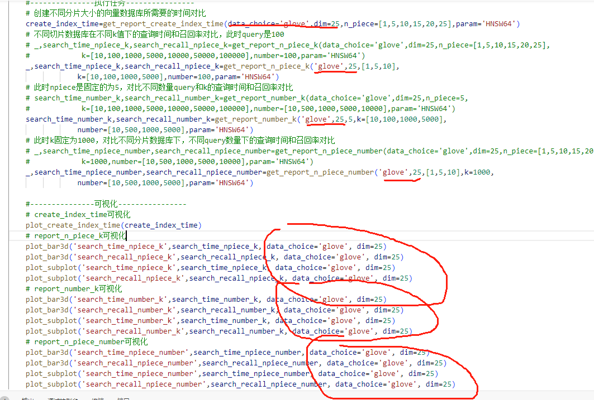

# 介绍

这是关于faiss向量数据库测试的相关代码，使用的数据集是glove-25和sift-128,数据来源[erikbern/ann-benchmarks: Benchmarks of approximate nearest neighbor libraries in Python (github.com)](https://github.com/erikbern/ann-benchmarks)

支持的测试内容：

- [x] 支持HNSW64,其余的还没测试
- [ ] 支持创建faiss数据库的不同参数测试
  - 个人感觉index_factory有些参数体现不全
- [x] 创建不同分片向量数据库的时间对比
- [x] 不同切片数据库在不同k（top k）值下的查询时间和召回率对比
- [x] 对比不同query数量下的查询时间和召回率对比
- [x] 对比不同分片数据库下，不同query数量下的查询时间和召回率对比
- [x] QPS-Recall测试
  - [x] HNSW
  - [x] IVFPQ
  - [x] IVFPQR
  - [x] IVF-Flat


# 使用说明-

1. 安装相关环境，`conda create -n faiss-test python=3.9`,`pip install -r requirements.txt`

2. 需要从[erikbern/ann-benchmarks: Benchmarks of approximate nearest neighbor libraries in Python (github.com)](https://github.com/erikbern/ann-benchmarks)中下载对应的数据集（是hdf5格式的文件）。然后再当前目录下创建一个data文件夹，将数据集放入即可。数据集名称：`glove-25-angular.hdf5`

## faiss_get_report/2

1. 该任务主要是用来测试在固定向量数据库参数下，不同数据库分片，query数量，k值下的查询时间和召回率。

2. 直接在faiss-test环境下运行`python faiss_get_report.py`或者`faiss_get_report2.py`，建议使用第二个，因为折线图比多个子图的对比更加的明显

3. 如果想要修改创建数据库的类型，可以修改`faiss_get_report.py`下的

   1. 

4. 创建数据库的相关文件是`faiss_database_create.py`创建的方式采用的是`faiss.index_factory(dim, param, measure)`具体可看

   1. [The index factory · facebookresearch/faiss Wiki (github.com)](https://github.com/facebookresearch/faiss/wiki/The-index-factory)

   2. 这里测试了四种类型

      1. `'HNSW64'`:64表示M,也就是每个节点的最大连接数

      2. `'IVF100,Flat'`:100表示nlist，也就是聚类中心的数量

         1. ```python
            faiss.index_factory(d, 'IVF100,Flat', faiss.METRIC_L2)
            '''
            	这里和quantizer = faiss.IndexFlatL2(d)，d=100
                index_ivf_flat_1 = faiss.IndexIVFFlat(quantizer, d, nlist, faiss.METRIC_L2)等效
            ''' 
            ```

      3. `IVFPQ`：`'IVF100,PQ5'`或者`'IVF100,PQ5x16'`，其中PQ5等价于PQ5x8：5表示M，8表示nbits

      4. `IVFPQR`：`'IFV100,PQ5+5'`：这里的两个5表示两次量化的量化器的数量，说明d要整除5。如果是PQ4+5，则d需要整除5和4

         1. 这里有个问题就是无法修改nbits和nbits_refine，不像ivfpq那样又PQ8x16:16就表示nbits。 因此关于IVFPQR这里先通过index_factory的方式简单创建进行实验。 关于QPS采用faiss.IVFPQR()的方式创建进行实验

   3. 如果你想要验证index_factory创建数据库的方式和indeflat这种直接用类创建的方式是否等效，可参考下面代码

      ```python
      # 验证两种方式是否相同
      import faiss
      import numpy as np
      # 数据和参数
      np.random.seed(42)
      d = 64  # 向量维度
      nlist = 100  # 聚类数量
      n_samples = 10000  # 样本数量
      query_vector = np.random.rand(1, d).astype(np.float32)  # 查询向量
      # 生成随机数据
      data = np.random.rand(n_samples, d).astype(np.float32)
      # 方法1
      quantizer = faiss.IndexFlatL2(d)
      index_ivf_flat_1 = faiss.IndexIVFPQ(quantizer, d, nlist,8,8)
      index_ivf_flat_1.train(data)
      index_ivf_flat_1.add(data)
      # 方法2
      description = 'IVF100,PQ8'# PQ8x8等价
      index_ivf_flat_2 = faiss.index_factory(d, description, faiss.METRIC_L2)
      index_ivf_flat_2.train(data)
      index_ivf_flat_2.add(data)
      # 查询
      k = 5
      D1, I1 = index_ivf_flat_1.search(query_vector, k)
      index_ivf_flat_2.nprobe = 1# 默认是1
      D2, I2 = index_ivf_flat_2.search(query_vector, k)
      # 验证结果是否一致
      result_equal = np.array_equal(I1, I2)
      result_equal2 = np.array_equal(D1, D2)
      print("Are the results equal?", result_equal,result_equal2)
      # 这两种方法等效
      #Are the results equal? True True
      # chatgpt给的答案
      ```

5. `faiss_test.py`主要是用来获取Recall，可以看数据是如何召回的

   1. 如果想要修改数据集，注意需要修改`faiss_get_report.py`下的`data_choice`和`dim`参数，这两个参数要与`config.py`中的字典`data_info`中信息匹配

   2. 

      ```python
      data_info={
          'glove':{25:'glove-25-angular',
                 50: 'glove-50-angular',
                 100: 'glove-100-angular',
                 200: 'glove-200-angular'},
          'sift':{128:'sift-128-euclidean'}
      }
      ```

      

6. 最后输出的结果是一组图片，存放在figure文件夹中，index文件夹存的是向量数据库

7. 这里还有关于faiss的一些个人学习资料，具体可看同文件夹下的：`Faiss-HNSW.md`

8. `data_use.ipynb`这个文件主要是测试方便，所有的函数都是先在这个文件上测试后再使用。这里面的代码比较杂乱。

## hnsw_qps_test

1. 这里主要是用来测试hnws不同创建参数（M,npiece(这个不算是创建参数，算数据集分片参数),efConstruction），在不同efSearch下的召回率和qps。

2. 这里采用的是`index_factory`来创建。

   - `string:HNSW64`,表示M=64，

   - 然后通过`index.hnsw.efConstruction = efConstruction`指定efConstruction

3. 其中`n_piece,M,efConstruction,efSearch`参数均是列表
   - 可在函数`get_multiple_data`和`get_multiple_QPS`中自行定义，但两者的参数要保持一致

4. 该实验下的文件命名规范为：

   - 总文件夹：index_HNSW_QPS

   - 每个数据的文件夹：glove-25-angular_n5_M16_efcon500

   - 每个数据的文件：glove-25-angular_M16_efcon500_n5_1.index

   - 存储图片的文件夹：figure/glove-25-angular_HNSW_QPS

   -  存储图片的文件：HNSW_QPS_multiple_lines.png

## IVFFLat_qps_test

1. 这里的的创建参数是nlist，以及数据集分片的参数是n_piece。查询参数为nprobe，默认值是1

2. 这里也是用`index_factory`创建

   1. `string:IVF100,Flat`:nlist=100

   2. `index.add`前需要训练：

      1. ```python
         if not index.is_trained: # 输出为True，代表该类index不需要训练，只需要add向量进去即可
         	index.train(df)
         ```

         

3. 数据文件命名规范和上面类似

## IVFPQ_qps_test

1. 这里的创建参数是IVF+PQ参数的结合:nlist,M(量化器数量，向量维度分片的数量),nbits（常用8，12，16）。查询参数：nprobe

2. 这里也是通过`index_factory`创建

   1. `string:IVF100,PQ5`这里的PQ5表示5个量化器，也就是M=5，默认的nbits=8，因此这里等价于`PQ5x8`

   2. `index.add`前需要训练：

      1. ```python
         if not index.is_trained: # 输出为True，代表该类index不需要训练，只需要add向量进去即可
         	index.train(df)
         ```

3. 但是有一个奇怪的点

   1. nbits=12的时候创建数据库的时间会大幅度的增加，nbits=8的时候只需要10几秒，但是nbits=12的时候用了差不多10分钟

      

4. 数据文件命名规范同上

## IVFPQR_qps_test

1. 这里的创建参数有点多，因此在for循环的时候采用了笛卡尔积的形式

   1. ```python
      from itertools import product
      # 定义多个列表
      list1 = [1, 2, 3]
      list2 = ['a', 'b', 'c']
      list3 = [10, 20]
      # 计算笛卡尔积
      cartesian_product = list(product(list1, list2, list3))
      for i,j,k in cartesian_product:
          print(i,j,k)
      # 列表中的每个元组中的元素分别是：n_piece,nlist,M,nbits,M_refine,nbits_refine
      cartesian_product = list(product(n_piece,nlist,M,nbits,M_refine,nbits_refine))
      ```

      

2. 这里的构造参数为：`nlist,M,nbits,M_refine,nbits_refine`以及数据分片参数：npiece。查询参数为nprobe.

   1. 这里的维度d不仅要整除m还必须上整除m_refine

3. 这里并未采用index_factory 的格式，因为该格式下无法修改nbits和nbits_refine

   1. ```python
      quantizer = faiss.IndexFlatL2(dim)
      index=faiss.IndexIVFPQR(quantizer, dim, nlist, M, nbits, M_refine, nbits_refine)
      # 这里最多传7个参数，但没有案列说明这样传参是否正确，所以建议如果不考虑nbits的话，使用index_factory
      ```

   2. 这里如果nbit和nbit_refine都是默认值8，则可以用index_factory来创建索引

      ​    对应的`string：f'IVF{nlist},PQ{M}+{M_refine}'`

   3. `index.add`前需要训练：

      1. ```python
         if not index.is_trained: # 输出为True，代表该类index不需要训练，只需要add向量进去即可
         	index.train(df)
         ```

4. 数据文件命名规范同上


# get_data_expand

该文件夹是用来创建扩展数据集的

扩展数据集：

- 原始数据集中的`ground_truth`数量是100
- 现在扩展数据集中的`ground_truth`数量是100000，实验时想取多少数据就将k设置为多少即可（在hnsw的qps测试中，topk和所采用的ground_truth数量都是相同的，都用参数k来进行管理）

直接运行`python create_data.py`，这里将会创建一个新的文件夹`data_expand`用来存储数据，数据的命名格式为`glove-25-angular-{count}.hdf:glove-25-angular-100000.hdf`其中100000表示每个测试用例存储的ground_truth的数量。

```python
if __name__ == "__main__":
    # 首先读取原始数据，这一部风数据是已经下载好的，放在data文件夹中
    filename='../data/glove-25-angular.hdf5'
    #要存储的ground_truth的数量
    count=100000
    # 这一部分扩展数据存放的地址
    out_put_fn = f'../data_expand/glove-25-angular-{count}.hdf5'
    get_data(filename, out_put_fn, 'angular', 'float', count)
```


# 文件修改说明

1. `faiss_get_report2.py`
   1. 这里相对于`faiss_get_report.py`将子图那一块修改了，直接观察子图不方便对比，这边将子图换成了在一个图中画多条折线图。`config.py`没有修改，关于多折线图依然对应`set_xlabel,set_ylabel`
2. 由于`faiss.IndexIDMap`有一定的bug，我们不采用该方法，修改了`faiss_test.py`中的`get_search_result`函数，并添加了`get_id`函数。同时修改了`faiss_database_create.py`中的`data_piece`函数和`create_index`函数
